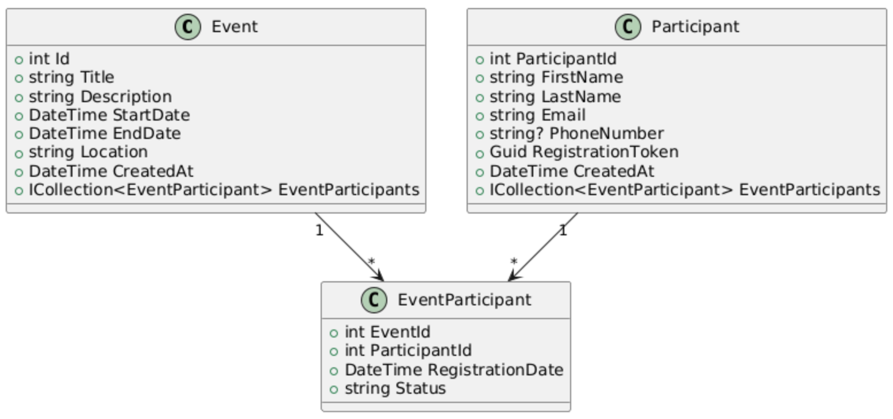

# cda-ecf-asp-net

The aim of the project is to have a working interface to display, add, update and delete events.
People can register to the events using their first name, last name, email and phone number.
Statistics are shown in a dedicated view.

## Conception

### Design

The mockups can be found [here](https://www.figma.com/design/GbJtSK4FEvkm1PBekKiX2h/cda-ecf-asp-net?node-id=0-1&p=f).

### Database structure

A SQL database manages the events and their participants as follows.


MongoDB is also used to store stats.

## Prerequisites

Before starting, ensure you have the following installed:
- [Docker](https://www.docker.com/products/docker-desktop)
- [.NET SDK](https://dotnet.microsoft.com/download)
- [Entity Framework CLI](https://learn.microsoft.com/en-us/ef/core/cli/dotnet)

## Start the local database

1. Navigate to the project root containing the `docker-compose.yaml` file.
2. Start the Docker container with the following command:
   ```bash
   docker-compose up -d
   ```
3. Verify that the database container is running:
   ```bash
   docker ps
   ```

## Create the database "cda-ecf-asp-net"

1. Connect to the database with your preferred tool.
2. Run a SQL query to create the database.
   ```sql
   CREATE DATABASE "cda-ecf-asp-net";
   ```
3. Ensure the database has successfully been created. 

## Migrate database structure

1. Navigate to the project folder.
2. Run the following dotnet command to apply migrations:
   ```bash
   dotnet ef database update
   ```

## Build and start the project

1. Navigate to the project folder
2. Run the following dotnet command to run the project:
   ```bash
   dotnet run
   ```